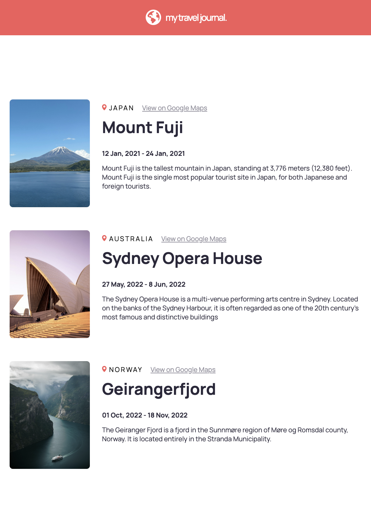

# React Travel Journal

A React travel journal page built for the Scrimba front-end developer path. Used as a learning exercise to practice props.

## Features

- Programatically renders location cards via React custom components & props from a data.js file

## Technologies Used

- HTML
- CSS
- JavaScript
- React
- Vite

## Resources

- [Figma design](https://www.figma.com/design/QG4cOExkdbIbhSfWJhs2gs/Travel-Journal)

## Installation

- `npm install`
- `npm run dev` for local server or `npm run build`